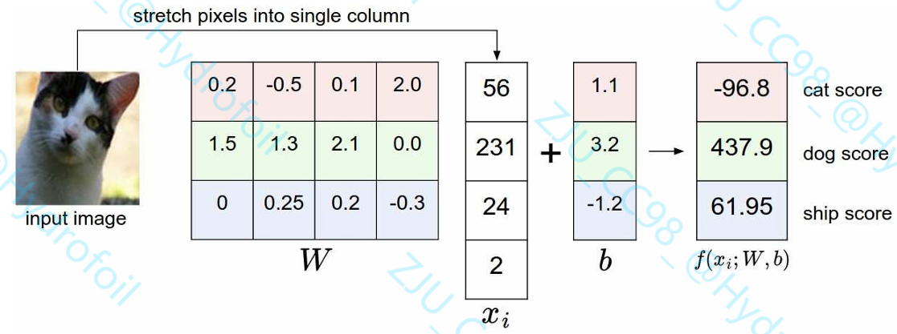

# 线性分类器与损失函数辨析

## 01｜Overview 本节主题概览

1. 定义了一个**评分函数（score function）**，把图像像素映射为各类别的分数。在线性分类器中，这个函数由权重 W 和偏置 b 决定。
2. 与 kNN 不同，这种**参数化方法（parametric approach）**在训练完成后只需要保留参数，不必保存全部训练数据；预测新样本时也更快，只需一次矩阵乘法。
3. 引入了 **bias trick（偏置技巧）**，把偏置向量并入权重矩阵中，便于统一计算。
4. 定义了**损失函数（loss function）**，用来衡量参数预测结果与真实标签之间的匹配程度。这里介绍了两种常见损失：SVM Loss 和 Softmax Loss。
5. 损失越小，说明模型在训练数据上的预测效果越好。

## 02｜Main Notes 正文笔记

> ### Knowledge Roadmap 知识主线

### 1. Linear Classification 线性分类器

我们的目标是，通过构建一个线性分类器，让图像在高维空间中线性可分；我们通过不断训练这个线性分类器，让其性能达到最优。
$$
f(x_i,W,b)=Wx_i+b
$$
我们假设图像$x_i$（或者说样本）所有像素都展平成一列向量，形状为`[D*1]`；权重矩阵W形状为`[K*D]`，偏置向量b为`[K*1]`，它们构成了函数的参数，也就是我们后续要去优化的东西。其中，`K`是所有标签数量。

#### Notice：和KNN相比的优点

我们的训练数据会用来训练参数$W,b$，但是一旦训练完成后，我们丢弃整个训练集，只保留那些已被训练的参数。这是因为，新的测试图像可以直接通过该函数并最终得到结果。



如上所示，矩阵$W$和$x_i$作乘法，并加上偏置项，得到**分数矩阵**，分数矩阵里的每个元素可以看作是$W$的每一行和$x_i$作点乘（内积）得到的标量。矩阵$W$的每一行对应着一个类别的分类器（很有意思的是，如果我们将其可视化成图片形式，将显示出对应标签类别物象的“轮廓”，相当于是一个**模板, template**）。

> 线性分类器学到的“模板”很粗糙。比如 horse 这一类，数据里既有朝左的马，也有朝右的马，于是线性分类器没法分别学出“左马模板”“右马模板”，只能把两种样子**硬揉成一个平均模板**，所以看起来像“双头马”。
>
> 而神经网络可以先在隐藏层学习很多更细的小检测器【也就是局部模式/细分模式】，再向上组合成更大特征，最后得到更为准确的类别判断。

#### Notice：对偏置项b的处理

为简化代码书写与训练过程，防止偏置项b带来的累赘效果，我们通常在**图像末尾添加一个恒为1的维度**；如在CIFAR-10中，$\boldsymbol x_i$的维度变成$[3072+1,1]=[3073,1]$. 相应的，我们将权重矩阵和偏置项整合为一个矩阵中，维度为$[10,3073]$

#### Notice：图像数据预处理

图像预处理通常先对训练集计算均值并做零均值中心化，再**根据需要进行数值缩放**；其中零均值中心化通常比单纯范围缩放更关键。

- 计算训练集像素均值 → 每个样本减去该均值 → 根据需要缩放数值

### 2. Multiclass Support Vector Machine loss 多类别支持向量机

SVM loss是一种定义**损失函数**的方法。如果分类器性能较低，损失函数的值通常会偏大，而我们要做的就是按条件更改参数矩阵的元素值（从而减小损失函数的值）来优化分类器。

简单来说，SVM loss**期望**的就是正确类别的分数显著比所有不正确类别的分数高一个幅度(margin)$\Delta$。例如，如果将样本$x_i$对于类别$j$的得分记作$\boldsymbol{s_j}=f(x_i,W)_j$，正确类别是$y_i$的话，样本$x_i$在线性分类器上的损失函数被定义为：
$$
L_i = \sum_{j \neq y_i} \max\left(0, s_j - s_{y_i} + \Delta\right)
$$
请注意，在本模块中，我们使用的是线性评分函数$f(x_i,W)=Wx_i$，因此我们也可以将损失函数改写为如下等价形式：
$$
L_i=\sum\limits_{j\not =y_i}\max(0,w_j^Tx_i-w_{y_i}^Tx_i+\Delta)
$$
利用转置，同形状向量作内积得到标量分数$s$，当然我们也可以将$x_i$写在左侧。

#### Notice：Hinge loss

- SVM loss的本质：超过 margin 就满意了，不再继续优化这个样本。

Hinge loss 的核心思想是**间隔约束**：当正确类别分数已经比错误类别分数至少高出一个 margin 时，该样本的损失为 0，不再对参数更新产生贡献。

### 3. Regularization 正则化

对于我们在上面提出的损失函数来说，有一个**Bug**，就是假设我们已经训练好了所有参数，矩阵$W$在优化器看来已经完满的时候，我们随意在矩阵前数乘一个大于一个参数$\lambda$，损失函数值皆为0。这是我们不希望看到的。大参数对模型的泛化能力起到毁灭性的打击：

- **大参数对噪声极度敏感：**比如图像分类中，一个像素的微小变化就会让模型的预测得分发生巨大偏移；
- **模型复杂度失控：**大参数对应着一个 “极端复杂” 的决策边界：为了完美拟合每一个训练样本，模型会学习到无数不必要的特征权重，本质是用极高的模型复杂度换取训练集的完美表现。

因此，我们提出**正则化惩罚（regularization penalty）**$\boldsymbol{R(W)}$，最为常见的正则化惩罚是L2形式，对所有参数采用逐元素平方（elementwise quadratic）计算：
$$
R(W)=\sum\limits_k\sum\limits_lW_{k,l}^2
$$
因此，我们最终的损失函数由**两部分**组成：数据损失 + 正则化损失
$$
\begin{align*}
L &= \frac{1}{N}\sum_i L_i + \lambda R(W) \\[6pt]
  &= \frac{1}{N}\sum_i \sum_{j \ne y_i}
     \left[\max\!\left(0,\; f(x_i;W)_j - f(x_i;W)_{y_i} + \Delta\right)\right]
     + \lambda \sum_k \sum_l W_{k,l}^2
\end{align*}
$$

#### Notice：L2正则化更倾向于小而分散的参数组成

L2 正则化会惩罚大的权重，倾向于让权重更小、更分散，从而减少某些特征影响过大，提升泛化能力，降低过拟合。例如，当输入$x=[1,1,1,1]$时，$w_1=[1,0,0,0]$和$w_2=[0.25,0.25,0.25,0.25]$的点积都等于 1，说明两者预测效果一样；但$w_2$的 L2 惩罚更小，所以更被偏好，因为它的权重更均匀、更分散。

### 4. Softmax classifier Softmax 分类器

Softmax分类器是**binary Logistic Regression（二元逻辑回归分类器）**的多分类推广；相较于SVM，它提供了一种更有直觉感的归一化概率输出：我们使用交叉熵损失（cross-entropy loss）代替了Hinge loss：
$$
L_i=-\log\left(\frac{e^{f_{y_i}}}{\sum_je^{f_j}}\right)\ \ \ \text{or equivalently} \ \ \ L_i=-f_{y_i}+\log\sum_je^{f_j}
$$
Softmax分类器对样本$x_i$提供了是每种标签的可能性“概率”，同时，如果正则化系数$\lambda$很大，则会趋向于输出更为平均的概率（因为参数会被优化得更小）：
$$
[1, −2,0] → [e^1,e^{-2},e^0]=[2.71,0.14,1] → [0.7,0.04,0.26]\\
[0.5, −1,0] → [e^{0.5},e^{-1},e^0]=[1.65,0.37,1] → [0.55,0.12,0.33]
$$

#### Notice：从信息论的角度理解交叉熵

我们定义“真实”分布$\boldsymbol p$和“预测”分布$\boldsymbol q$之间交叉熵为：
$$
H(p,q)=-\sum\limits_xp(x)\log(x)=H(p)+D_{KL}(p\Vert q)
$$
在监督分类中，真实标签分布 p 是固定的 one-hot 分布，因此最小化交叉熵等价于最小化真实分布与预测分布之间的 KL 散度。

#### Notice：数值稳定性

在 softmax / 交叉熵的实际计算中，若直接对原始分数取指数，容易因分数过大而出现**指数爆炸**，导致数值溢出。为保证稳定性，通常会先将每个分数减去该样本中的最大分数，再进行指数运算。

由于 softmax 对所有分数同时减去同一个常数后结果不变，这种处理不会改变最终的概率分布，因此交叉熵的计算结果也保持不变，只是数值上更加稳定。

## 03｜Coding/Math Connection 与数学对应的代码

```python
# 在每张图片后拼接一个恒为1的维度，将偏置项并入权重矩阵
X_train = np.hstack([X_train, np.ones((X_train.shape[0], 1))])
```


## 04｜Retrieval Section 自测区

