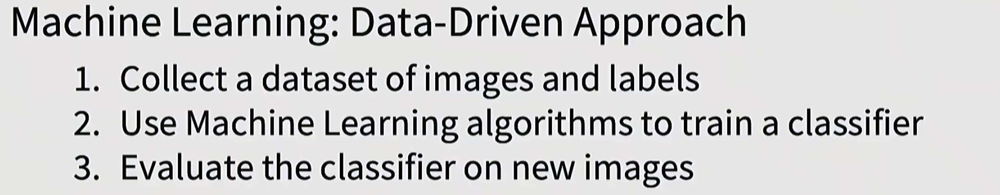
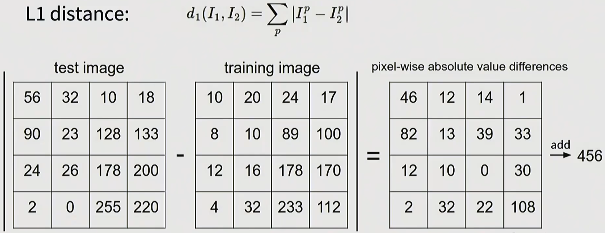
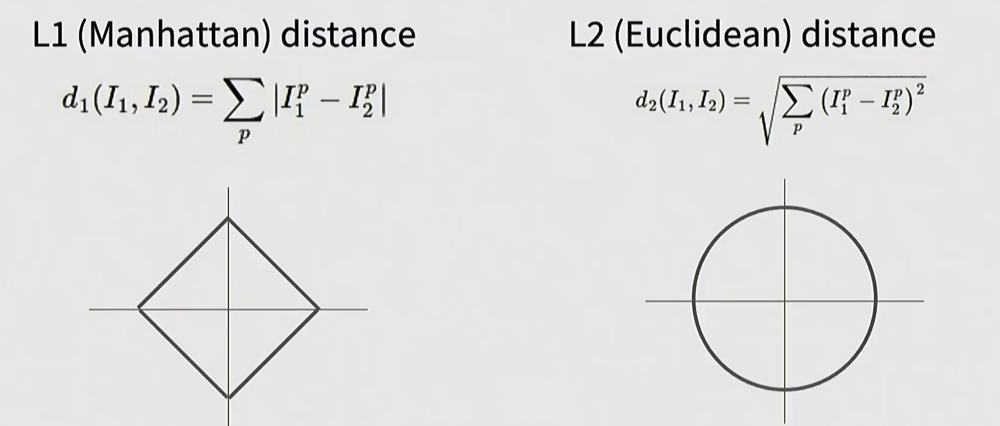
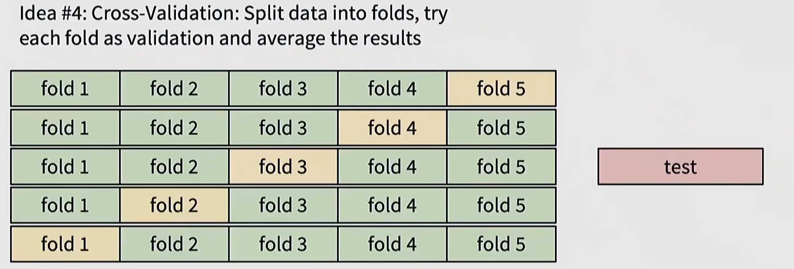
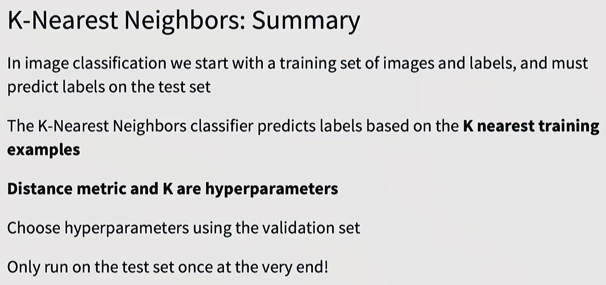

什么是张量（Tensor）？

- 张量就是**多维数组（0-无穷维）**，是机器学习里统一用来表示数据的基本数据结构。

1. 收集带有标签的数据集，我们的训练都将基于此数据集；
2. 使用一个机器学习的算法来训练一个分类器；
3. 用新的图像（同样带有标签）来评估我们训练出的分类器。

**Storing the image：**24-bit储存方法，RGB三个通道各占8-bit存储空间（取值范围0-255）【有些时候是32-bit，因为png图像有A通道（透明度信息）】

NN-分类器：不需要任何时间训练分类器，但是预测时间复杂度非常大。

- K-NN 分类器：允许少量错分，提升鲁棒性。

L1-Distance保留了数据的一些形状特征（如果我们旋转特征轴，曼哈顿距离和其函数值将会有区别），而L2-Distance不会。因此，L1距离对**单个点的突变/异常**（特征值）非常灵敏。

超参数：Hyperparameter

