线性分类器：

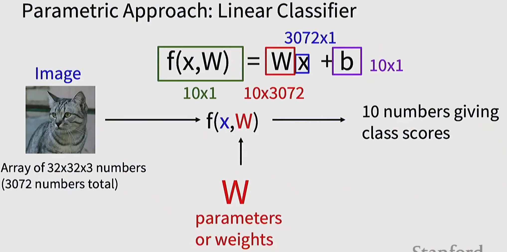

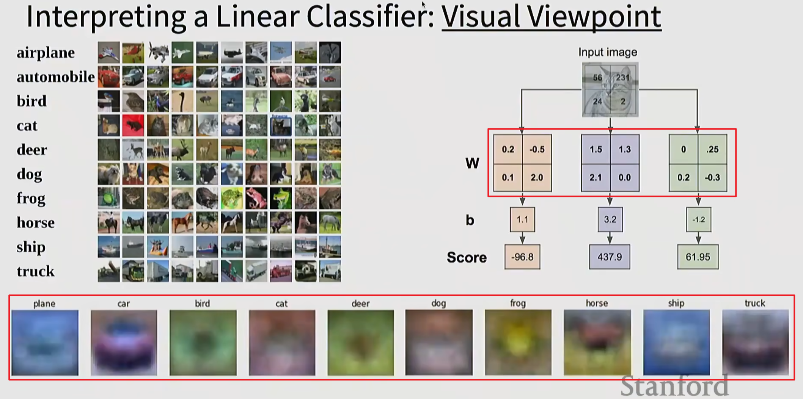

下面红框的**「类别可视化图」**，就是上面红框权重矩阵 `W` 的 **reshaped 可视化版本**，二者数学上完全等价，只是呈现形式不同。

因此可以想到卷积神经网络由低层到高层的特征建构于识别模式。可视化出来也就是基本如此！

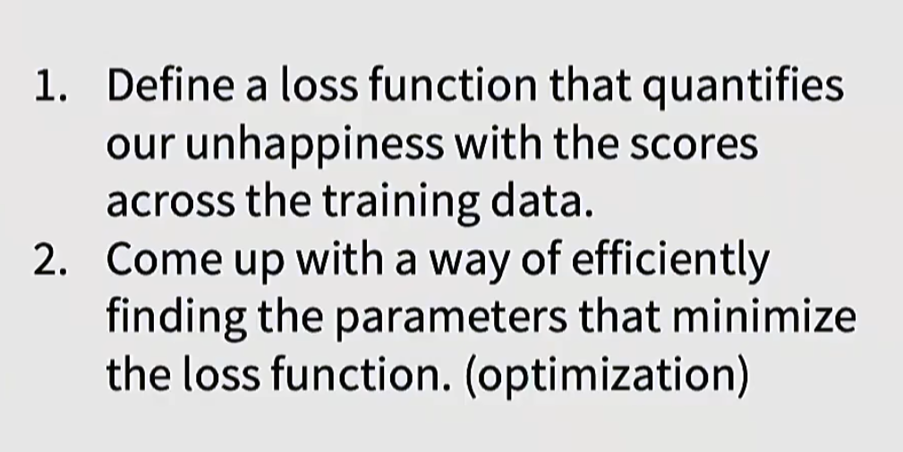

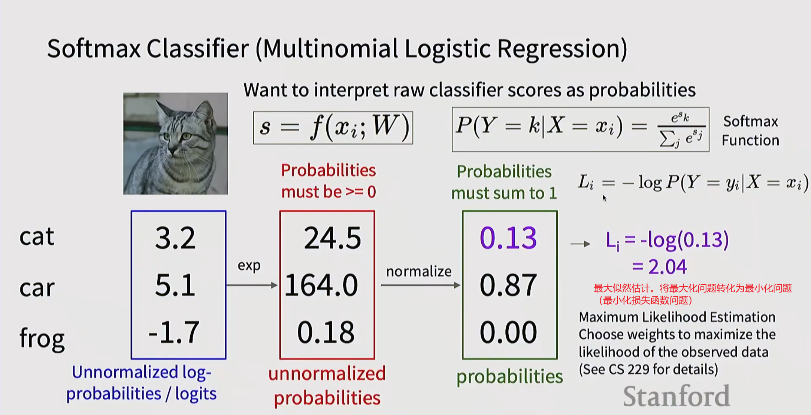

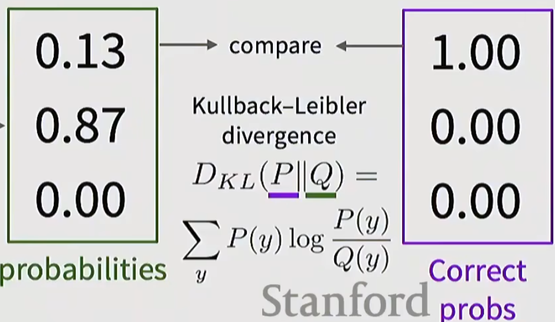

KL散度，另一种定义损失函数的方式。

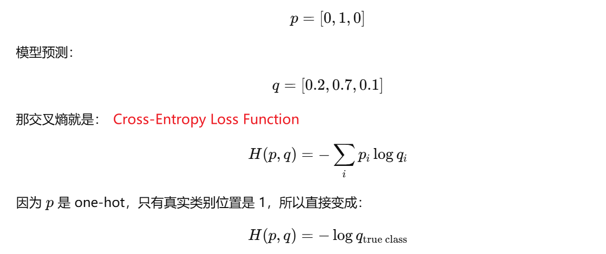

我们一般将**真实标签分布（One-Hot）**记为$p$，**模型标签分布**记作$q$，则可以定义交叉熵损失：

> 这里真实的标签y就是个独热码。

$$
H(p,q) = H(p)+D_{\text{KL}}(p||q)\\
H(p)=-\sum \limits _xp(x)\cdot \log p(x)\\
D_{\text{KL}}(p||q)=\sum \limits _yp(y)\log\frac{p(y)}{q(y)}
$$

如何得到模型标签分布：原始图像经过线性分类器（矩阵相乘，加上偏置）后得到一个原始score，将这个原始score经过softmax函数处理，得到分布q.

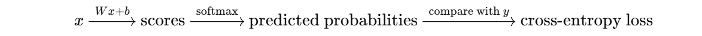

> 第$i$个样本的损失函数$L_i$，对参数矩阵（已将偏置项纳入考量范围）第$j$个类别（第$j$列）的参数的偏导数为：
> $$
> \frac{\part L_i}{\part W_j}=\frac{\part L_i}{\part s_j}\cdot\frac{\part s_j}{\part W_j}=\begin{cases}
> -x_i+x_ip_j, & j=y_i \\
> x_ip_j, & j\not=y_i
> \end{cases}
> $$
> 注意，该公式为向量形式，形状为$(D,)$.其中$j$可换成任意其余标签下标编号。

## Regularization & Optimization

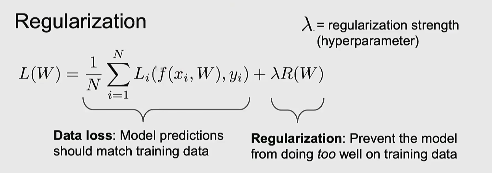

### Back propagation 反向传播

我们想要更新的是参数矩阵中的权重值（和偏置项b），要求的是损失函数L对于W的偏导。

虽然W是一个矩阵，但我们完全可以将其看作是一个多维度向量$W=\{w_1,w_2,w_3,...,w_n\}$，而L又是关于W的函数，因此可以看作是对多维度向量中的每一个分量进行求导，再组合成同形状的矩阵。
$$
\frac{\partial L}{\partial W} = \begin{bmatrix}
\frac{\partial L}{\partial w_{11}} & \cdots & \frac{\partial L}{\partial w_{1n}} \\
\vdots & \ddots & \vdots \\
\frac{\partial L}{\partial w_{m1}} & \cdots & \frac{\partial L}{\partial w_{mn}}
\end{bmatrix}
\\
W=W-η\frac{\partial L}{\partial W}
$$
同时满足链式法则：

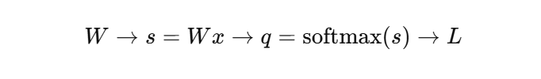

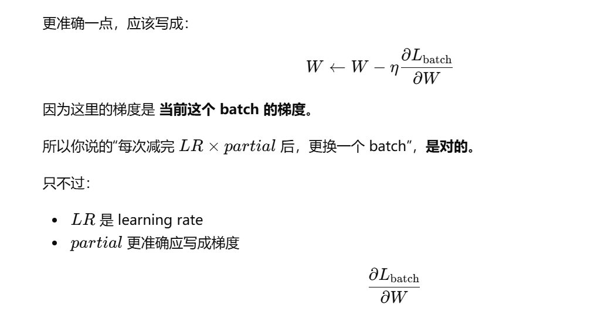

SGD-随机梯度下降。仔细看上面的损失函数$L(W)=\dfrac{1}{N}\sum\limits^N_{i=1}L_i(f(x_i,W),y_i)+\lambda R(W)$，这里的$N$代表着所有样本，而SGD每次下降梯度是**随机选取一部分样本作为一个minibatch**。这样计算得到的梯度下降路径虽然有点曲折但是大体方向仍然是对的。

### SGD WITH Momentum

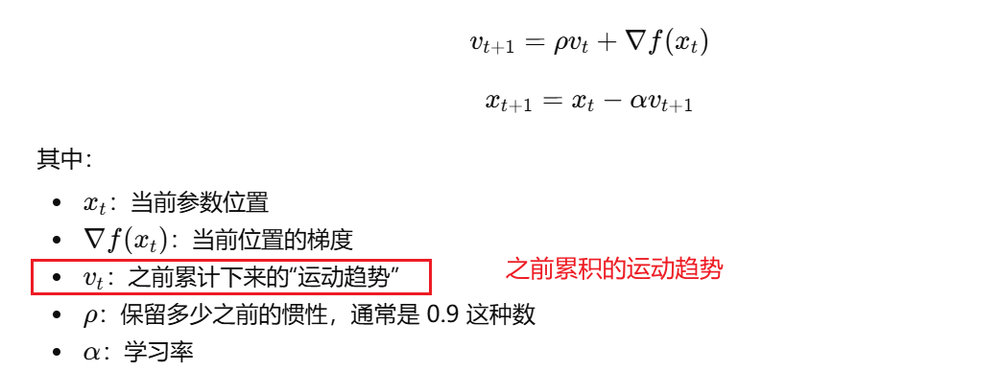

### RMSProp

按参数自适应地缩放学习率，不是所有参数都用一样的步长。
$$
x-=\mathrm{learning\_rate}\cdot\frac{dx}{\sqrt{\text{grad\_squared}+10^{-7}}}
$$
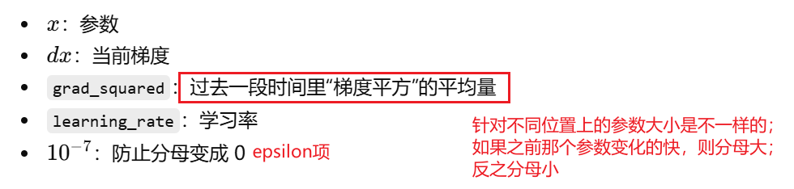

那么$\text{grad\_squared}$怎么算呢？也很简单，有以下公式：用“指数滑动平均”的方式，记录过去梯度平方的平均大小。所以计算机组成种有限状态机的概念非常有用。虽然与编程能力没有关系，但是能够复用至很多计算机场景中。

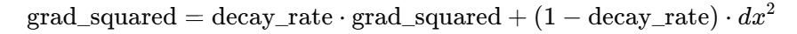

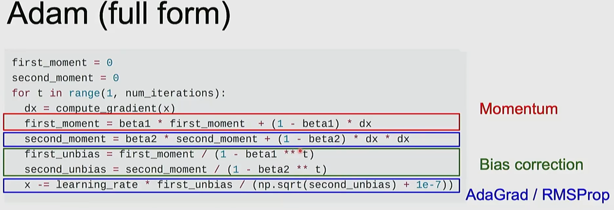

关键的来了：Adam优化器，这是当前深度学习中最为主流的优化器模式，其实也就是结合了之前所讲的SGD+MOMENTUM+RMSPROP

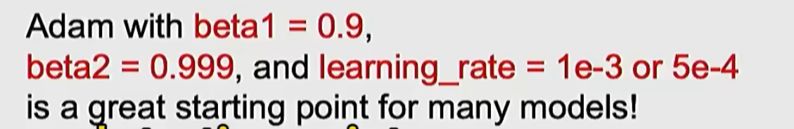

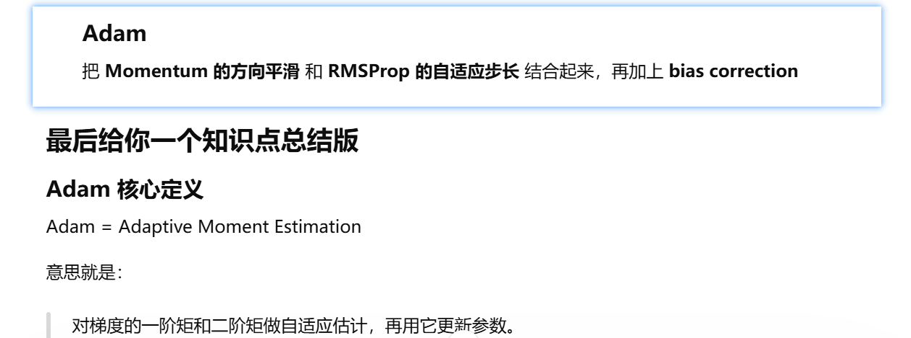

学习率是可以变化的！

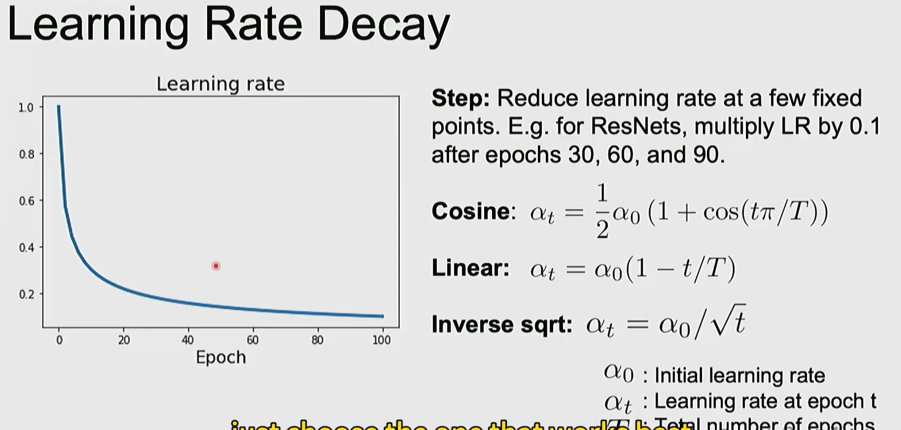

> Decay:腐烂/衰退
>
> rule of thumb：经验法则